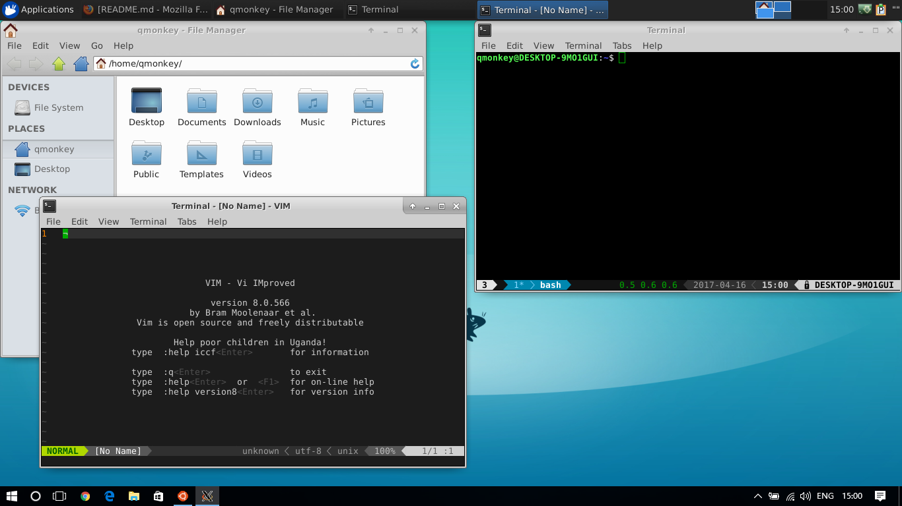
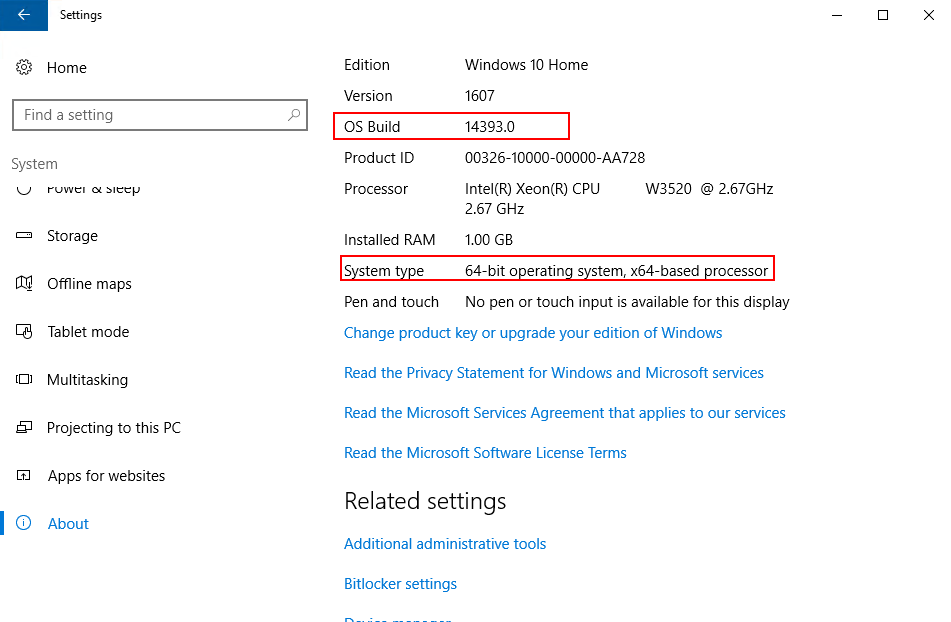
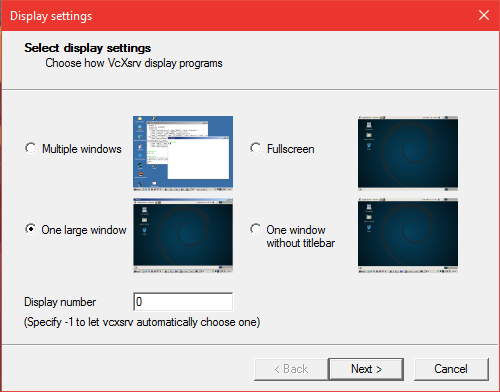

# wsl-tutorial 

- :kr: Translated into Korean

이 튜토리얼에서는 Linux 용 Windows 서브 시스템에서 데스크탑 환경을 실행하는 방법을 설명합니다. 더 이상 가상 시스템으로 개발 환경을 구축할 필요가 없습니다. :)

## 스크린샷



## 선행 요건

귀하의 PC는 **Windows 10 애니버서리 업데이트 빌드 14393 이상**의 64 비트 버전을 실행하고 있어야합니다.

PC의 CPU 아키텍처와 Windows 버전/빌드 번호를 확인하려면 **설정 > 시스템 > 정보**를 엽니다. OS 빌드 및 시스템 유형 필드를 찾으십시오.



## 설치

Windows에서 Bash를 실행하려면 다음과 같이 수동으로 해야 합니다:

#### 1. 개발자 모드 켜기


#### 2. "Linux 용 Windows 서브 시스템 (베타)"기능 사용 가능


## Linux 용 Windows 서브 시스템 활성화 후

#### 1. 컴퓨터를 다시 시작하십시오.

#### 2. bash를 실행합니다.


license를 수락하면 Ubuntu 사용자 모드 이미지가 다운로드되고 시작 메뉴에 "Bash on Windows on Bash" 바로 가기가 추가됩니다.

## VcXsrv 설치

[VcXsrv](https://sourceforge.net/projects/vcxsrv/) 최신 버전을 설치하세요.

## Ubuntu 업그레이드

```bash
sudo apt-get update
sudo apt-get upgrade
```

## xfce 데스크탑 설치

```bash
sudo apt-get install xfce4-terminal
sudo apt-get install xfce4
```

## 디스플레이 서버 지정

귀하의 `~/.bashrc` 에 DISPLAY=:0.0 추가하세요, 그리고 `source ~/.bashrc` 를 실행하는 것을 잊지 마세요. :)

```bash
export DISPLAY=:0.0
export LIBGL_ALWAYS_INDIRECT=1
```

## dbus 오류 수정 (Ubuntu 14.04 만 해당)

바꿔야 합니다.

```xml
<listen>unix:tmpdir=/tmp</listen>
```

다음도 함께,

```xml
<listen>tcp:host=localhost,port=0</listen>
```

/etc/dbus-1/session.conf 입니다.

## 연결 거부 수정. (우분투 14.04 만 해당)

바꿔야 합니다.

```xml
<auth>EXTERNAL</auth>
```

다음도 함께,

```xml
<auth>ANONYMOUS</auth>
<allow_anonymous/>
```

/etc/dbus-1/session.conf 입니다.

## 디스플레이 서버 열기

**XLaunch** 를 열고 "One large window" 또는 "One large window without titlebar" 를 선택하고 "display number"를 0으로 설정하십시오.

다른 설정은 기본값으로 두고 구성을 완료합니다.



## xfce 데스크탑 실행

"Bash on Windows on Bash" 에서 다음 명령을 실행하십시오.

```bash
startxfce4
```

## powerline 글꼴 렌더링 수정

[Hack](https://github.com/source-foundry/Hack#linux) 폰트의 최신 버전을 설치하십시오.

## 유니코드 글꼴 렌더링 수정

```bash
sudo apt-get install fonts-noto
sudo apt-get install fonts-noto-hinted
sudo apt-get install fonts-noto-mono
sudo apt-get install fonts-noto-unhinted
```

## 중국어 글꼴 렌더링 수정

```bash
sudo apt-get install fonts-noto-cjk
```

## mkdir 명령의 권한이 오류 수정

bashrc 에 다음 쉘 코드를 추가하십시오.

```bash
if grep -q Microsoft /proc/version; then
    if [ "$(umask)" == '0000' ]; then
        umask 0022
    fi
fi
```

## 중국어 입력 방법 설치

#### 1. fcitx 설치

```bash
sudo apt-get install fcitx
sudo apt-get install fcitx-pinyin
```

#### 2. bashrc 파일에 다음 명령을 추가하십시오

```bash
export XMODIFIERS=@im=fcitx
export GTK_IM_MODULE=fcitx
export QT_IM_MODULE=fcitx
```

#### 3. 재 로그인

## 드롭-다운 터미널 설치

```bash
sudo apt-get install guake
```

## wsl 종료하는 방법

#### 1. VcXsrv 닫기

#### 2. “Bash on Ubuntu on Windows” 종료

## 즐기세요

개발 환경을 즐기십시오. :)

## 참조

- [Microsoft wsl install guide](https://msdn.microsoft.com/en-us/commandline/wsl/install_guide)
- [Run any Desktop Environment in WSL](https://github.com/Microsoft/BashOnWindows/issues/637)
- [Bash on windows getting dbus and x server working](https://www.reddit.com/r/Windows10/comments/4rsmzp/bash_on_windows_getting_dbus_and_x_server_working/)
